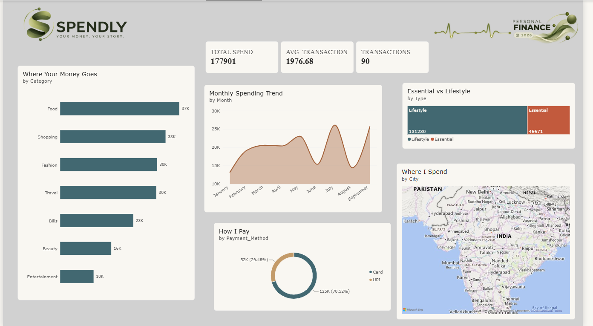

# SPENDLY — Personal Finance & Lifestyle Dashboard

> **Your money, your story.**

Spendly is an interactive personal finance dashboard built to understand spending patterns across categories, cities, payment methods, and lifestyle choices.

The project combines Excel-based data preparation with Power BI and DAX to transform transaction data into an interactive visual experience.

---

## 📊 Dashboard Preview



---

## ✨ What I Built

- Created an interactive personal finance dashboard in Power BI
- Analyzed total spending, transaction count, and average transaction value
- Visualized monthly spending trends
- Analyzed spending across categories and subcategories
- Compared Essential vs Lifestyle spending
- Analyzed payment method usage
- Compared spending across cities
- Designed a branded fintech-style dashboard experience

---

## 🛠️ Tools & Technologies

- **Power BI** — Dashboard development and data visualization
- **DAX** — Measures and calculations
- **Microsoft Excel** — Data preparation and analysis
- **CSV** — Transaction dataset

---

## 📈 Dashboard Insights

The dataset contains:

- **90 transactions**
- **₹177,901 total spending**
- **7 spending categories**
- **13 subcategories**
- **5 cities**
- **2 payment methods**
- Data covering **January–September 2026**

The dashboard explores:

- Where the money goes
- How spending changes over time
- Essential vs Lifestyle spending
- How payments are made
- Where spending occurs geographically

---

## 📁 Project Structure

```text
Spendly
│
├── Spendly_Dashboard.pbix
├── Spendly_Data.xlsx
├── spendly_data.csv
│
└── Screenshots
    ├── 1.PNG
    ├── 2.PNG
    └── 3.PNG